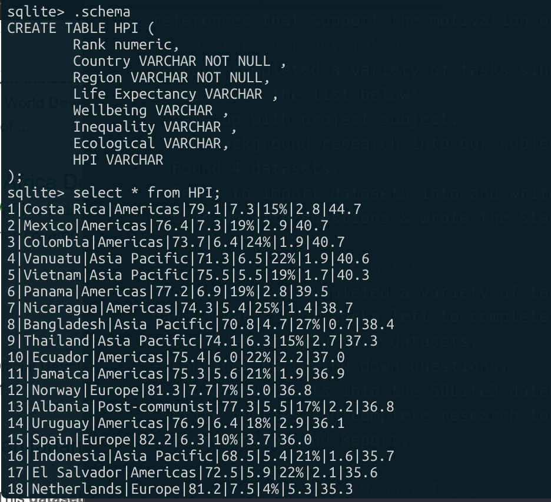
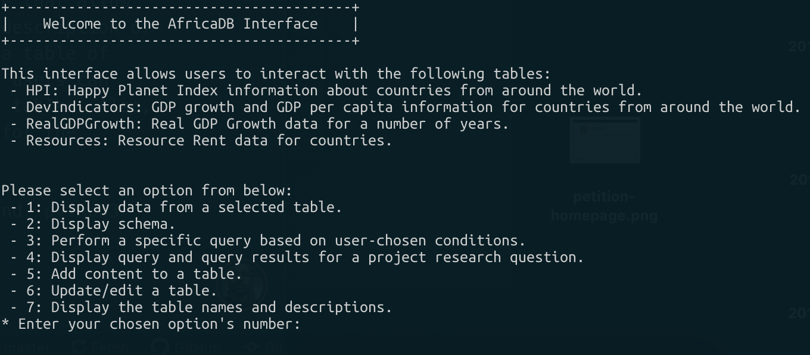
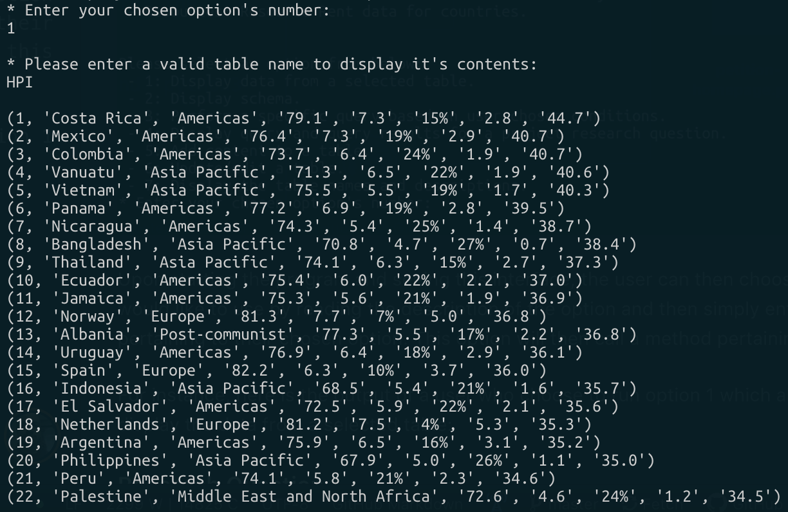
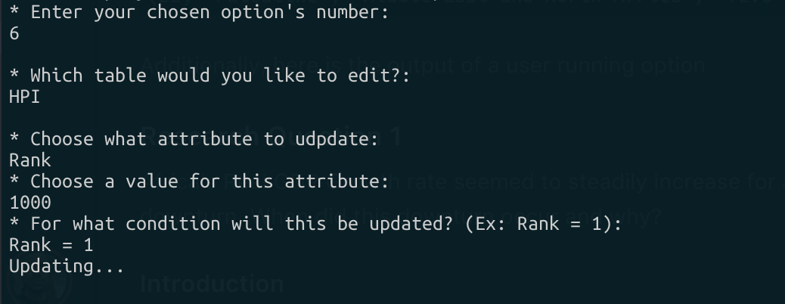
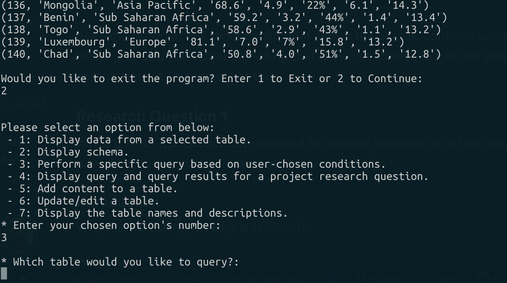

### Date: 5 May 2019
### Name(s): Christian Lussier, Robert Samuel, Jordan Wilson

### Final Report

#### Project Overview
Our project looks into a variety of questions surrounding African development and economics using database systems. African development and economic trajectories are a hot topic for researchers and organizations tasked with implementing sustainable growth in African countries. As a result, our project looks into a number of things, such as why Africa's Real GDP growth rate suddenly declined after years of steady growth and if there is a correlation between region of residence and citizen happiness. Our research has provided a number insights into these questions, finding for instance, that African citizens of countries in the MENA region seem to be much happier than those in Sub-Saharan Africa. Our project will use database systems to try and answer questions related to the development and economic trajectories of African countries.

##### Motivation
We were motivated to pursue this project for a number of reasons. For one, despite African countries gaining independence from their colonial masters in the mid-1900s and receiving financial aid, loans, and more, African countries have faced great problems in their development and with developing their economies to compete in the global market. We were motivated to try and see if we could try to solve some of these problems or at least find clues/correlations relating to these problems. Additionally, a few of our group members are economics minors taking classes relating to African Development, making them interested in learning more outside of that class.

This project has real-world relevance in that it is looking at real data regarding Africa. With this, economists and development experts are trying to solve problems relating to Africa's poor development and economic patterns. This research could benefit others in this regard, such as the experts researching Africa everyday to try and solve problems. We feel that trying to answer the questions below could provide some valuable insights into what is stopping African economic development. With this, these questions could find correlations between different ideas to see if they have any impact on another. The correlations and results stemming from this research could provide valuable insights into these problems. Additionally, the casual observer who is interested in African economics could also be benefited by this research as they could find out more about the topic.

##### Background Information

There are a variety of related works that discuss Africa's slow development patterns and poor economic trajectories. For example, the source ["Why Has Africa Grown Slowly"](https://www.aeaweb.org/articles?id=10.1257/jep.13.3.3) touches upon a number of ideas surrounding Africa's slow growth over the last twentieth century, while discussing some of the issues African economies have faced. This source notes that while Africa's economic and development future looked bright in the 1960s, political deterioration stemming from the implementation of dictatorship and autocratic regimes hurt the economic trajectories of many African countries. With this, the source also notes that African countries seem to have much higher trade barriers and misaligned exchange rates than their global peers. Additionally, the authors Collier, Paul, and Gunning, note that one the many factors contributing to the poor and ever-changing economies of African countries is a heavy reliance on natural resources. This reliance often leads to unsustainable and unpredictable outcomes that comes with the market value of the resources on a global scale. This is part of the reason why for question 5, we are looking into the economics of countries with higher natural resource rents.

Additionally, [a related work from the Wiley Online Library](https://onlinelibrary.wiley.com/doi/epdf/10.1111/roiw.12013) also touches upon this subject, discussing the contemporary statistical foundations of the recent growth in per-capita GDP and reduction in poverty, finding that these "growths" were actually quite weak in reality. This source also discusses how the data published by African companies about their economies is often weak or inflated from previous works. This is because many African countries do not have the capability to collect, manage, and properly analyze data that they are actually able to collect. This is in part because of a lack of funding for this area and fragmentation between groups assigned to work with this data.

Another source that discusses African economies comes in the form of ["Foreign Direct Investment and Economic Growth: The Case of Developing African Economies"](https://link.springer.com/article/10.1007/s11205-014-0679-6). This work looks into the relationship between foreign direct investment (FDI) and economic growth for 23 African countries over a period spanning from 1970 to 2011. The research from this source indicates that there is a "bidirectional causal relationship between economic growth and FDI". With this, the authors note that while FDI was found to have a positive impact on the economies of African countries, that these effects do vary from country to country. The study goes on to note that African countries should take more steps to promote FDI.

###### References
- Collier, Paul, and Jan Willem Gunning. 1999. "Why Has Africa Grown Slowly?" Journal of Economic Perspectives, 13 (3): 3-22.
- Devarajan, S. (2013), Africa's Statistical Tragedy. Review of Income and Wealth, 59: S9-S15. doi:10.1111/roiw.12013
- Seyoum, Mebratu, Renshui Wu, and Jihong Lin. "Foreign direct investment and economic growth: The case of developing African economies." Social Indicators Research 122.1 (2015): 45-64.

##### Building Our Database System
We took a variety of steps to build our database system. We began by acquiring data from credible online sources, such as the World Bank (the data used will be detailed below for the relevant questions). After procuring our data, we began to build our database system using Sqlite3. To do this, we first created a database builder file called `africaDB-build.txt`. This file contains a command to run the builder file, `africaDB-build.txt | sqlite3 africaDB.sqlite3`. It also contains code that will drop/create the necessary tables that will be used to store the data acquired from online sources. Additionally, the builder file also contains schema that will be used for some of the tables where necessary, that will put the attributes and lay out the necessary information for each table.

After this, the builder file sets the separator which will be used to separate the data being read in by the Sqlite3 database. In this case, the separator is set as a comma, `,`, because the database will be reading in CSV files where the values are separated by commas. The builder file then contains code that will read the CSV files into the database, putting them in their specific tables, so that they can be accessed for work with queries and other database-related tasks.

###### Tables & Schema
Inside of our Sqlite3 database system, we created 4 tables, detailed below:
- The "HPI" Table: This table contains data from the [Happy Planet Index](http://happyplanetindex.org). The Happy Planet Index is an index that takes in many factors and determines how happy a country must be, based on how well their country is doing. Some of the factors that the Happy Planet Index use are well-being, life expectancy, inequality of outcomes, and ecological footprint. For well-being, the Happy Planet Index took data from the Gallup World poll and used it to determine the well-being of residents' life on a scale from zero to ten. For life expectancy, the Happy Planet index used data collected from the United Nations and life expectancy is the average number of years a person is expected to live in each country. For inequality of outcomes, the Happy Planet index just took the data from well-being and life expectancy and just expressed those numbers as percentages. Lastly, for ecological footprint, The Happy Planet index used the Global Footprint Network and it is the average impact that each resident of a country places on the environment.
  - [Happy Planet Index Website.](http://happyplanetindex.org)
- The "DevIndicators" Table: Contains a number of development indicators such as the GDP Growth (annual %) and GDP per capita for a number of African countries, spanning the years 2000-2012. This gives us an insight into the standards of living for these countries.
  - The data for this table can be found [here](https://databank.worldbank.org/data/source/africa-development-indicators#).
- The "RealGDPGrowth" Table: Contains the Real GDP Growth rate for Africa over the span of years from 1980-2024.
  - [Click here for the data source for IMF - Real GDP Growth in Africa.](https://www.imf.org/external/datamapper/NGDP_RPCH@WEO/OEMDC/ADVEC/WEOWORLD)
- The "Resources" Table: Contains data about the Natural Resource Rents (as a % of GDP) for African countries. This indicates what percentage of a country's GDP is from natural resources.
  - [Natural Resource Rents (% of GDP) source.](https://data.worldbank.org/indicator/ny.gdp.totl.rt.zs)

All of these tables contain important content that was useful for answering the project questions. More information about the importance of each table in terms of what questions it was used for will be provided with the writing for each question.

SCHEMA




###### User Interface
We looked into a variety of different ways to create a user interface for our project. The user interface needed to allow users to interact with the database but not contain visible querying code. With this criteria in mind, we narrowed down our interface options to three different tools, Django, Flask, or a command-line based Python interface. Eventually, we decided to create a Python command-line interface for a few reasons. For one, we felt that we had more experience in using Python with Sqlite3 for such a purpose which would make it easier and less time consuming to implement than the other options. Additionally, we felt that for the criteria required, a command-line interface would be very simple to use while still allowing the user to complete all necessary actions.

The command line interface allows the user to complete a number of tasks, by giving users a variety of different options with how to run the program. For instance, it allows the user to display all of the data from a table of their choosing, without forcing them to write a query and instead allowing them to just enter a table name. Additionally, there are features in place that allow the user to get the names of the tables in the database, a brief description of each, and the table schema. The user can also perform a query in a table of their choosing, using conditions that they specify. Additionally, users can also insert content into tables of their choosing and update/edit tables. Also, users can use a feature that will display the research questions for the project, the query used to solve them, and the query results.

The user interface when the program is first ran (using the command `python3 interface.py`):


Upon starting the program and seeing this interface, the user can then choose which option they would like to use by reading the description of the option and then simply entering the number pertaining to their chosen option. This option will then call a method pertaining to this option.

For instance, here is the output of a user who choose to run option 1 which allows them to display the data from a selected table:


Additionally, here is the output of a user running option 6 which allows the user to update the table:


Also, the program has functionality that allows the user to continue using the program after running through an option, meaning that they can choose to exit the program or run another option. Here is an example of this:


This user interface, created using Python and the Sqlite3 package, allows the user to easily interact with the Sqlite3 database in a text-based setting. With this, it does not force the user to concern themselves with writing Sqlite3 queries or insert statements. It instead allows the user to interact with the database in a simple manner, allowing them to do things such as look at a table's data and schema, perform update and insert commands for a specified table, and perform customized queries. This interface enhances the user experience when interacting with the project database.

#### Research Question 1
Africa's Real GDP Growth rate seemed to steadily increase for a few decades, but then it took a downturn. When did this downturn occur and why?

##### Introduction
We asked this question because this question gives us some extra insight to how the economy is in Africa and how African development is being affected. African did take a downturn and we want to know why and this question helps us assess  and shed some light on why. This question is relevant for a number of reasons. We first have to delve into Africa history a little to better understand the situation that has been in Africa for decades now. Using the websites and the information we found, we created tables and graphs to try and help answer this question.

##### Queries
To determine when Africa' Real GDP Growth rate took a sudden downturn, we used data from our RealGDPGrowth table as it contained information regarding Africa's Real GDP Growth rate from 1980 to 2024 (it is predicted for future years). With this our original query was simply:
```
SELECT * FROM RealGDPGrowth;
```

This simple query allowed us to see trends and narrow down the more specific years to look for where this downturn. With this we created our final query with these narrowed down years, from 2008-2012.

The finalized query used in the database was:
```
select "2008", "2009","2010","2011","2012" from RealGDPGrowth;
```

##### Results

Africa's real GDP Growth rate did take a bit of a downturn. From using the graphs and tables we made, it seems that Africa's downturn happened around 2010. Using our knowledge from previous courses and online information we found that the downturn occurred because of numerous reasons. The first reason we can start with is that Africa is plagued with wars. Ever since colonialism, Africa has had consistent terror and corruption in their continent. Colonialism was when European countries invaded Africa, took their land, and enslaved African people. This set Africa back a few decades. Towards the end of the 20th Century, African countries started to gain their independence but they were still at a disadvantage. Since the African countries had been ruled by European powers for so long, they didn't actually know how to take care of themselves and we still see this kind of thing in Africa today. This hurt Africa real bad. People who are not fit to rule stepped up and took rule over countries they weren't equipped in ruling. Rulers then became power hungry and would decide to not ever give up power. This obviously lead to lots of corruption in the continent and normal everyday citizens were really struck by this in a bad way.

This lead to something known as the Arab Spring in the MENA region. After so many citizens in the MENA region in Africa faced low living standards while they saw their ruler live in luxury, they got very angry and rebelled against him. This happened in a few countries and a result of this were countries who felt like they could start over to become a better nation with a good standard of living for everyone and with a decent government. Another big thing in Africa that happened around this time was the lost decade. The tools we used were first the websites that we used to gather the data on Africa and second, the database we built. The database allowed us to search through a number of years to see the real GDP of some years. the query we used was select "2008", "2009","2010","2011","2012" from RealGDPGrowth and with this, we were able to see the years where the real GDP growth took a drop. This query certainly helped us get an answer and an explanation on why the rate took a drop.

###### Graphics
Graphics for results.

<!-- ------------------------------------------------------------------ -->
#### Research Question 2
Is there a correlation between GDP per capita and inequality rankings (income inequality)?

##### Introduction

It can be reasoned that wealthier countries should have a lower inequality gap since there is more wealth to be distributed. However, this may not always be the case due to various reasons. For example, the style of government could facilitate mass hoarding of wealth by the upper class, which tends to happen in dictatorships. The goal of this question find a correlation between inequality and a countries GDP.

##### Queries
This question used data from the HPI table to get information regarding inequality. It also used data from the DevIndicators table in order to look at the GDP Per Capita for African countries.

The queries used in this question were:
```
SELECT Country, Inequality from HPI WHERE region = "Sub Saharan Africa" OR "Middle East and North Africa";

SELECT "Time", "Country Name", "GDP per capita (current US$) [NY.GDP.PCAP.CD]" from DevIndicators WHERE "Country Name" = "Mauritius" OR "Country Name" = "Ethiopia" OR "Country Name" = "Zambia" OR "Country Name" = "Kenya" OR "Country Name" = "Mozambique" OR "Country Name" = "Comoros" OR "Country Name" = "Nigeria" OR "Country Name" = "Liberia" OR "Country Name" = "Tanzania" OR "Country Name" = "Malawi" OR "Country Name" = "Zimbabwe" OR "Country Name" = "Senegal" OR "Country Name" = "Namibia" OR "Country Name" = "Ghana" OR "Country Name" = "Rwanda" OR "Country Name" = "Uganda" OR "Country Name" = "Republic of Congo" OR "Country Name" = "Mauritania" OR "Country Name" = "Burkina Faso" OR "Country Name" = "Gabon" OR "Country Name" = "Niger" OR "Country Name" = "Cameroon" OR "Country Name" = "Lesotho" OR "Country Name" = "Botswana" OR "Country Name" = "Djibouti" OR "Country Name" = "South Africa" OR "Country Name" = "Guinea" OR "Country Name" = "Burundi" OR "Country Name" = "Swaziland" OR "Country Name" = "Sierra Leone" OR "Country Name" = "Cote d'Ivoire" OR "Country Name" = "Benin" OR "Country Name" = "Togo" OR "Country Name" = "Chad";
```

The first query used to answer this question gets the country name and inequality percentage ranking from the HPI table where the region is either Sub-Saharan Africa or the MENA region so that only African countries are outputted. The second query selects the year ("Time"), Country Name, and GDP Per Capita from the DevIndicators table. Additionally, this query uses "OR" statements to find and display data from African countries only.

##### Results
```
Mauritius|17%
Ethiopia|36%
Zambia|41%
Kenya|38%
Mozambique|43%
Comoros|36%
Nigeria|44%
Liberia|38%
Tanzania|33%
Malawi|45%
Zimbabwe|37%
Senegal|33%
Namibia|26%
Ghana|38%
Rwanda|37%
Uganda|41%
Republic of Congo|40%
Mauritania|37%
Burkina Faso|43%
Gabon|36%
Niger|40%
Cameroon|47%
Lesotho|42%
Botswana|28%
Djibouti|42%
South Africa|33%
Guinea|42%
Burundi|48%
Swaziland|41%
Sierra Leone|50%
Cote d'Ivoire|45%
Benin|44%
Togo|43%
Chad|51%
```

###### Graphics

<!-- ------------------------------------------------------------------ -->
#### Research Question 3
Is there a correlation between living standards (HPI) and GDP per capita?

##### Introduction

In most cases wealthier countries are able provide a better standard of living for their citizens. For example, in the U.S. inequality tends to be high between different economic classes, however this tends to negligible in many cases because the living standard for almost any American is higher than that of of a third world country. In some cases the living standard for the poorest segment of Americans could be better than that of the upper class of other poorer nations. For a continent like Africa, where most of the countries are third world, we expected to see better standards of living for countries who have a higher GDP per capita because of the greater wealth circulating.

##### Queries

The queries used in the question were:
```
SELECT Country, HPI from HPI WHERE region = "Sub Saharan Africa" OR "Middle East and North Africa";

select "Time", "Country Name", "GDP per capita (current US$) [NY.GDP.PCAP.CD]" from DevIndicators;
```
##### Results

###### Graphics

<!-- ------------------------------------------------------------------ -->
#### Research Question 4
Are countries that live in a specific region overall happier than countries that don't live in that region? (i.e. Sub-Saharan Africa and MENA)

##### Introduction

We asked this question because we wanted to know if living in a certain region in Africa has any correlation to happiness. In order to live a good life, we believe everyone has to have a level of happiness and we believe that this question will shed some light on whether or not living in a specific region in Africa has any correlation at all to happiness and if so, which region is overall happier. This is relevant because it is tied within our theme of African development and growth. Overall, we our goal is to find some patterns in the data we see with Africa and try and figure out if those patterns will have any affect on what the future may hold.

To investigate this issue we used the HPI table containing Happy Planet Index for the data for coming up with finding out the answer to this question. This is because the Happy Planet Index takes into a number of factors (detailed earlier on in this report) to calculate the Happy Planet Index, representing how happy the citizens of specific countries are. This made the HPI table the perfect choice to answer this question.

##### Queries
The query used in the database was:
```
select * from HPI where region = "Sub Saharan Africa" OR region = "Middle East and North Africa";
```

We used this to get the HPI scores of each region and try and figure out which region is overall happier.

##### Results
Based on the results from our query, the MENA (Middle East and North Africa) region seems to be happier than the SSA (Sub-Saharan Africa). The top of the list in terms of HPI rankings were dominated by MENA countries when comparing MENA and SSA countries. This makes sense because MENA countries have been found to be better off economically and are often more developed than SSA countries.

Here are a portion of our results:
```
22|Palestine|Middle East and North Africa|72.6|4.6|24%|1.2|34.5
30|Algeria|Middle East and North Africa|74.3|5.6|24%|2.1|33.3
33|Morocco|Middle East and North Africa|73.4|5.0|25%|1.7|32.7
54|Israel|Middle East and North Africa|81.9|7.1|8%|6.2|28.8
63|Mauritius|Sub Saharan Africa|74.0|5.5|17%|3.5|27.4
66|Ethiopia|Sub Saharan Africa|62.8|4.6|36%|1.0|26.7
67|Iraq|Middle East and North Africa|69.0|4.7|27%|1.9|26.5
68|Turkey|Middle East and North Africa|74.7|5.3|19%|3.3|26.4
71|Tunisia|Middle East and North Africa|74.6|4.5|22%|2.3|26.2
77|Zambia|Sub Saharan Africa|58.4|5.0|41%|1.0|25.2
83|Kenya|Sub Saharan Africa|60.3|4.5|38%|1.0|24.2
84|Iran|Middle East and North Africa|74.8|4.6|23%|2.8|24.0
86|Egypt|Middle East and North Africa|70.7|4.2|23%|2.2|23.8
88|Mozambique|Sub Saharan Africa|54.3|5.0|43%|0.9|23.7
93|Comoros|Sub Saharan Africa|62.6|4.0|36%|1.0|23.1
94|Yemen|Middle East and North Africa|63.3|4.1|39%|1.0|22.8
95|Nigeria|Sub Saharan Africa|52.1|5.5|44%|1.2|22.2
96|Liberia|Sub Saharan Africa|60.2|4.4|38%|1.2|22.2
97|Tanzania|Sub Saharan Africa|63.5|4.0|33%|1.3|22.1
98|Malawi|Sub Saharan Africa|60.1|4.3|45%|0.8|22.1
```

<!-- Based on the results from our query, Sub Sahara Africa seems to be overall happier than the Middle East and North Africa. Looking at Africa's history, this does make sense. The Sub Saharan region in Africa overall have worse socio-economic indicators than the Middle East and North Africa region but there are not quite as many revolts within in country. A big thing that struck the Middle East and North African region was the Arab Spring. The Arab Spring was a string of revolts lead by the residents of a country. This was a big thing in the Middle East and North Africa region so it makes sense why the residents of the Middle East and North African region would have an overall less happy score than the residents of the Sub Sahara region. -->

##### Graphics

<!-- ------------------------------------------------------------------ -->
#### Research Question 5
Do African countries with a higher natural resources rent (as a % of GDP) have a higher GDP per capita or vice versa? Do the findings from this question make steps to validate the idea of the resource curse?

##### Introduction
Many countries in Africa are afflicted by the resource curse, which when a country has an abundance of natural resources, but they are unable to properly collect them due to various reasons. Major reasons include intercontinental wars, civil wars, a lack of technology, or they're simply too dangerous to extract. This has led to several countries that have a low GDP, yet an abundance of resources. The queries for this question aim to affirm whether this resource curse is true.

##### Queries

The following queries were used to answer this question:
```
select "Country Name", "2011" from Resources;

select * from DevIndicators WHERE "Time" = 2011;
```

##### Results
```
Angola|44.5142476068548 5318.0403682016
Benin|4.76591951929875 801.644281225183
Botswana|3.61844801327403 8532.61722168124
Central African Republic|9.35334782277437 489.146364001488
Cote d'Ivoire|8.80536500677469 1194.55859933097
Egypt, Arab Rep.|12.0508676470673 2780.94924552693
Ethiopia|17.974887804527 356.967287240092
Gabon|39.300279159929 11113.8884680599
Guinea|21.6059540351796 497.90485542705
Gambia, The|7.01314792175681 505.760570130748
Guinea-Bissau|13.2552539075768 625.549056362593
Kenya|3.32036193476484 808.000571785527
Liberia|40.3506749335596 374.333222192516
Lesotho|3.59849853015823 105.91323856084
Madagascar|7.39439042593381 465.011424822866
Mali|13.1342707005088 683.511241908842
Mozambique|9.77201852840251 533.313665208799
Niger|10.784940994768 374.445406345683
Nigeria|18.1962733026269 1501.72158251684
Rwanda|6.96956335829798 582.555660780284
Sudan|21.5884851590529 1866.44473303669
Senegal|5.01949916868631 1119.35728769979
Uganda|12.6504981990651 487.105498050193
South Africa|8.63690139269013 8070.03209040967
Zambia|21.8108034497212 1425.31379369828
Zimbabwe|10.9992668914335 757.089017888128
```


###### Graphics

<!-- ------------------------------------------------------------------ -->
#### Concluding Remarks


###### Please add screen shots in your report. The code to add graphics is the following:

(edit as necessary)
